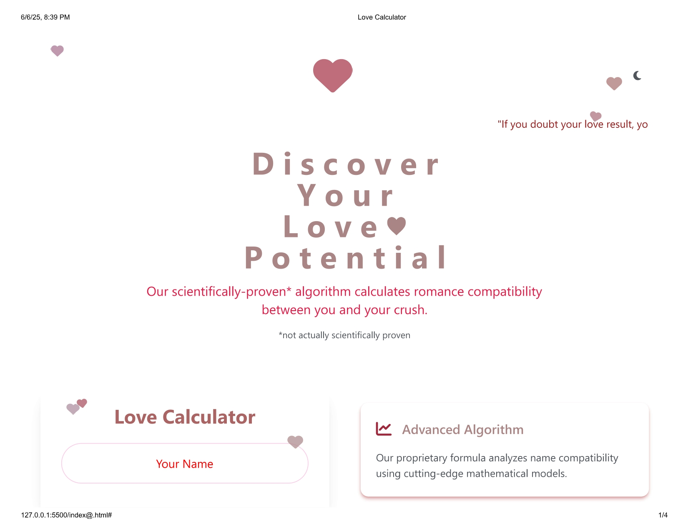

# 💘 Love Calculator - Vanilla HTML, CSS & JS

A lightweight, responsive, and privacy-focused Love Compatibility Calculator made using pure front-end technologies.

[🔗 Live Demo](https://your-deployed-link.com)  
![Preview]

<a href="#" target="_blank">
  
</a>

---

## 📌 Features

```txt
✓ Instant Love Score Calculation
✓ Works Offline (No Server Needed)
✓ 100% Browser-Based (Private & Secure)
✓ Responsive UI with Clean Layout
✓ Fun Custom Algorithm (For Entertainment)
✓ Dynamic Testimonials + FAQ Section
✓ Semantic HTML5 + CSS3 Animations
🧠 Tech Stack
HTML5       → Semantic Markup
CSS3        → Layout, Transitions, Media Queries
JavaScript  → DOM Logic, Event Handling, Algorithm
Tailwind
📁 File Structure
love-calculator/
│
├── index.html        # Main UI structure
├── style.css         # Styling + Responsive design
├── script.js            # Calculator Logic + Interactions
└── img/
    └── thumbnail.png # Preview image
🎯 Highlights
// Input Fields: Your Name, Crush's Name, Birth Dates (optional)
const score = calculateLoveScore(name1, name2); // 🔮 Magic formula

// Fast & Fun UX
document.querySelector("#calculateBtn").addEventListener("click", runLoveCheck);

// Client-Side Privacy
// -> No API calls, no tracking, no data storage
❓ FAQ
Is the calculation accurate?

Not scientifically proven — just for fun.

Is data saved?

Nope. Everything stays in your browser.

Can I skip birth dates?

Yes. They’re optional.
🔍 Use Case Ideas
💌 Date Night Icebreaker

🧪 Fun Project in Your Portfolio

🖥️ Practice DOM, Layout, Animations

📝 License
MIT License. Free to use and modify.

© 2023 Love Calculator. All rights reserved.
Privacy Policy | Terms of Service | Contact Us
